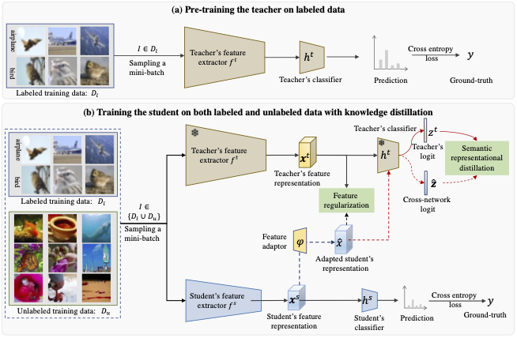

##  Knowledge Distillation Meets Open-Set Semi-Supervised Learning
The implementation is based on the open-source benchmark [RepDistiller](https://github.com/HobbitLong/RepDistiller).

This repo

**(1) introduces more realistic open-set semi-supervised learning settings (OS-SSL):CIFAR-100 as labeled data, Tiny-ImageNet or Places365 as unlabeled data.**

**(2) covers the extention of [SRD](https://openreview.net/pdf?id=ZzwDy_wiWv) to OS-SSL:**

**(3) benchmarks 12 state-of-the-art knowledge distillation methods from [RepDistiller](https://github.com/HobbitLong/RepDistiller) in the OS-SSL settning**

**(4) benchmarks 7 state-of-the-art semi-supervised methods in the proposed OS-SSL setting based on open sourced codes ([PseudoLabel](https://github.com/iBelieveCJM/Tricks-of-Semi-supervisedDeepLeanring-Pytorch),
[MeanTeacher](https://github.com/iBelieveCJM/Tricks-of-Semi-supervisedDeepLeanring-Pytorch),
[MixMatch](https://github.com/YU1ut/MixMatch-pytorch),
[FixMatch](https://github.com/kekmodel/FixMatch-pytorch),
[MTCR](https://github.com/YU1ut/Multi-Task-Curriculum-Framework-for-Open-Set-SSL),
[T2T](https://github.com/huangjk97/T2T),
[OpenMatch](https://github.com/VisionLearningGroup/OP_Match)).**

## Method
<div style="text-align:center"></div>

## Requirements
- Python>= 3.6
- PyTorch>=1.0.1
- tensorboard
- tensorboardX
- tqdm
- progress
- matplotlib
- numpy
- scikit-learn
- scikit-image
- opencv-python

## Preparation
- Download TinyImageNet: ``` wget http://cs231n.stanford.edu/tiny-imagenet-200.zip ``` Put in folder 'tinyImageNet200'
- Download: Places365 datasets. ```torchvision.datasets.Places365(folder, download=True,small=True) ``` Put in folder 'places365'

## Running

1. Fetch the pretrained teacher models by:

    ```
    sh scripts/fetch_pretrained_teachers.sh
    ```
   which will download and save the models to `save/models`

2. Run distillation by following commands in `scripts/run_cifar_distill.sh`.

3. Run semi-supervised by following commands in `scripts/run_ssl.sh`.
